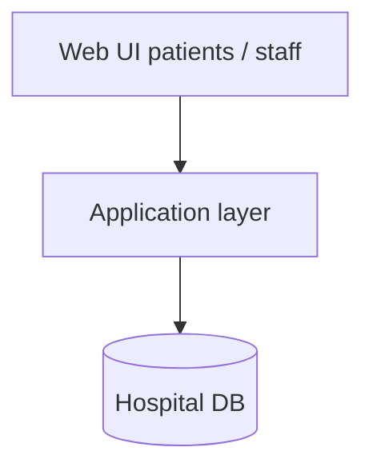

# HMS (Hospital Management System)

Course / team project archive for a hospital management system (contributors noted in the repo description: Hamza, Rajab, TY).

## What is here

The working tree currently stores a zipped snapshot:

- `E-Hospital-main 2.zip`

Extract it locally to browse the source.

```bash
unzip "E-Hospital-main 2.zip"
```

## Architecture (typical HMS shape)



Exact modules depend on the extracted project (appointments, records, staff roles, etc.). Prefer that tree as the source of truth once unzipped.

## Related

There is also an empty `HospitalMS` repo on this account. Treat this `HMS` archive as the one with files.
